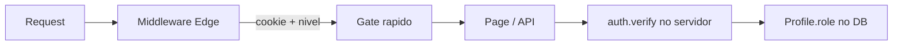

# PR: Refatoração estrutural + Auth unificado

> **Para o time:** este PR não é só “mover pasta”. É uma reorganização de como o projeto **separa responsabilidades**, **protege rotas** e **escala permissões**. Leia como uma aula — cada seção explica o *problema*, a *decisão* e o *como usar daqui pra frente*.

---

## Resumo em 30 segundos

Heramos um Next.js App Router com código espalhado, auth duplicado (sessão custom + NextAuth morto), middleware fraco e dezenas de `isAdmin()` / `isAgent()` espalhados pelo código.

Este PR:

1. **Organiza o front** por audiência (`(public)`, `(auth)`, `(client)`, `(admin)`) sem mudar URLs
2. **Consolida tudo sob `app/`** (`server/`, `lib/`, `_components/`, etc.)
3. **Substitui auth legado** por sessão custom + hierarquia configurável em JSON
4. **Unifica checagem de permissão** em uma API: `auth.verify(permission, actor)`

~570 arquivos tocados — a maioria são moves/imports, não lógica nova.

---

## Aula 1 — Por que a estrutura importa

### Problema

Antes, `app/` misturava rotas e código compartilhado no mesmo nível:

```
app/
├── admin/          ← rota
├── dashboard/      ← rota
├── components/     ← NÃO é rota
├── lib/            ← NÃO é rota
├── server/         ← NÃO é rota
└── page.tsx
```

Quem abre o projeto não sabe, só olhando a pasta, o que gera URL e o que é biblioteca interna.

### Decisão: Route Groups + pastas privadas

**Route groups** `(nome)` são convenção do Next.js: organizam arquivos **sem alterar a URL**.

```
app/(admin)/admin/kanban/page.tsx  →  URL: /admin/kanban
       ↑ invisível na URL
```

| Grupo | Quem usa | Exemplos de URL |
|-------|----------|-----------------|
| `(public)` | Visitante | `/`, `/criar-ticket`, `/acompanhar` |
| `(auth)` | Login/signup | `/auth/login` |
| `(client)` | Cliente logado | `/dashboard/*` |
| `(admin)` | Staff | `/admin/*` |

**Pastas `_`** (`_components`, `_hooks`) são **privadas** no App Router — não viram segmento de URL.

### Por que não mudamos as URLs?

Bookmarks, integrações, middleware e links externos já apontam para `/admin`, `/dashboard`, etc. Route groups reorganizam o filesystem **sem breaking change**.

Leitura: [`app/STRUCTURE.md`](../app/STRUCTURE.md)

---

## Aula 2 — O que é `app/server/` (e o que não é)

Confusão comum: “o app é Next, por que tem pasta `server`?”

| Camada | Onde | Papel |
|--------|------|-------|
| **Portaria HTTP** | `app/api/**/route.ts` | Recebe request, devolve response |
| **Domínio** | `app/server/` | Controllers → Services → Repositories |
| **UI** | `app/(admin)/`, `_components/` | Páginas e componentes |

O Next **já é full-stack**. `app/server/` não é outro servidor — é **organização de regra de negócio** para não inflar cada `route.ts` com Prisma + validação + lógica.

Fluxo ideal:

```
Request → route.ts (3 linhas) → controller → service → repository → DB
```

---

## Aula 3 — Auth: o que estava errado

### Antes (bagunça)

Três sistemas convivendo:

1. **Sessão custom** (`portal_session`) — usada de verdade no login
2. **NextAuth** — configurado, quase ninguém usava
3. **RBAC no banco** (`rbac_roles`) — existia, quase não protegia páginas

Além disso:

- Middleware **não exigia login** em `/admin`
- Metade das pages admin checava sessão; metade não
- Roles legados: `client`, `agent`, `supervisor`, `super_admin`… difícil de raciocinar
- Helpers espalhados: `isAdmin()`, `isDeveloper()`, `isAgent()`, arrays hardcoded `['admin', 'agent', ...]`

Isso viola **DRY** e **segurança por obscuridade** — cada dev inventava sua checagem.

### Decisão

- **Manter** sessão custom (já funciona, time conhece)
- **Remover** NextAuth
- **4 roles hierárquicos:** `user` → `developer` → `admin` → `master`
- **Config externa** em JSON para níveis e rotas
- **Uma função** para checar permissão: `verify()`

---

## Aula 4 — Hierarquia de permissões (como pensar)

Definido em [`config/access-control.json`](../config/access-control.json):

| Nível | Rank | Quem |
|-------|------|------|
| `user` | 10 | Cliente (`/dashboard`) |
| `developer` | 20 | Operador (kanban, tickets) |
| `admin` | 30 | Gestão (analytics, audit) |
| `master` | 40 | Config (users, settings) |

**Regra de ouro:** se a rota pede `developer`, quem tem rank **≥ 20** passa (`developer`, `admin`, `master`).

Quer um nível custom `unicornio` entre developer e admin? Só adiciona no JSON com `rank: 25`. **Sem deploy de código.**

Cada rota pode ter `minLevel`. Contextos definem piso mínimo:

- `/admin/**` → floor `developer` (cliente nunca entra no admin)
- `/dashboard/**` → floor `user`

---

## Aula 5 — Middleware vs servidor (duas camadas de propósito)



**Middleware** ([`middleware.ts`](../middleware.ts)):

- Roda no **Edge** — sem Prisma
- Exige cookie `portal_session` em `/admin` e `/dashboard`
- Usa `portal_access_level` (cookie legível) para redirect rápido
- **Não é a fonte da verdade** — cookie pode ser forjado

**Servidor** (`auth.require`, `auth.verifyRequest`):

- Valida token no banco
- Relê `Profile.role` do DB
- **É onde a segurança real acontece**

Analogia: middleware = segurança do prédio (crachá visível); servidor = conferência no banco de dados.

---

## Aula 6 — A API que vocês devem usar (DRY)

### Uma função para checar permissão

```typescript
import { auth, verify } from '@/lib/auth'

// Por nível hierárquico
verify('admin', session)        // admin ou master
verify('developer', session)    // staff (developer+)

// Por rota (lê o JSON)
verify('/admin/settings', session)

// Cliente (não staff)
!verify('developer', session)
```

Arquivo central: [`app/lib/auth/verify.ts`](../app/lib/auth/verify.ts)

### Fluxos completos

| Situação | Código |
|----------|--------|
| Layout admin | `await auth.require('developer')` |
| Layout dashboard | `await auth.requireAuthenticated()` |
| API route (sessão) | `await auth.requireRequest(req, 'admin')` |
| API route (sessão ou API key) | `await auth.verifyRequest(req)` |
| Controller | `this.requirePermission(request, 'admin')` |

**Não use mais:** `isAdmin()`, `isDeveloper()`, arrays `['admin', 'agent', ...]`, imports de `@/lib/auth/roles` (removido).

Leitura completa: [`docs/auth.md`](./auth.md)

---

## Aula 7 — API Keys

Chaves externas (`x-api-key`) agora têm:

- `access_level` — teto hierárquico
- `route_grants` — whitelist opcional
- `route_denials` — blacklist (ex.: admin sem `/admin/automation`)

Mesma lógica de `verify()` — mesma regra, dois tipos de ator (sessão ou key).

---

## Aula 8 — Como adicionar uma rota nova (checklist)

1. Crie a page/API normalmente
2. Adicione em `config/access-control.json`:

```json
{ "pattern": "/admin/minha-feature", "minLevel": "developer" }
```

3. No layout ou handler, use `auth.require(...)` ou `auth.verifyRequest(...)`
4. **Não** copie checagem de role manualmente

Se esquecer o JSON, o **floor do contexto** (`/admin` → `developer`) ainda protege.

---

## Migração de roles (dados)

| Antigo | Novo |
|--------|------|
| `super_admin` | `master` |
| `admin`, `manager`, `supervisor` | `admin` |
| `agent` | `developer` |
| `client` | `user` |

Migration: `prisma/migrations/20260615000100_auth_access_levels/`

**Antes de testar em staging:**

```bash
npx prisma migrate deploy
```

---

## O que saiu / entrou

| Removido | Substituído por |
|----------|-----------------|
| NextAuth + `SessionProvider` | Sessão custom |
| `isAdmin`, `isDeveloper`, `roles.ts` | `verify()` / `auth.*` |
| `portal_role` cookie | `portal_access_level` |
| `components/`, `hooks/` na raiz de `app/` | `_components/`, `_hooks/` |
| `backend/` na raiz | `app/server/` |

---

## Test plan (QA)

- [ ] Cliente (`user`): acessa `/dashboard`, **bloqueado** em `/admin`
- [ ] Developer: acessa `/admin/kanban`, **bloqueado** em `/admin/users`
- [ ] Admin: acessa `/admin/analytics`, **bloqueado** em `/admin/settings`
- [ ] Master: acesso total ao admin
- [ ] Sem cookie em `/admin` → redirect `/auth/login`
- [ ] API key com `route_denials` em automation → 403 nessa rota, 200 em analytics
- [ ] Login/logout/magic-link ainda funcionam
- [ ] URLs públicas (`/criar-ticket`, `/acompanhar`) sem login

---

## Documentação no repo

| Doc | Conteúdo |
|-----|----------|
| [`docs/auth.md`](./auth.md) | Auth completo |
| [`app/STRUCTURE.md`](../app/STRUCTURE.md) | Organização do front |
| [`docs/refactor-continuation.md`](./refactor-continuation.md) | Próximos passos |
| [`config/access-control.json`](../config/access-control.json) | Permissões editáveis |

---

## Perguntas que juniors devem saber responder após este PR

1. **O que é route group e por que `(admin)` não aparece na URL?**
2. **Qual a diferença entre middleware e `auth.verifyRequest`?**
3. **Quando uso `verify('admin', x)` vs `verify('/admin/foo', x)`?**
4. **Onde configuro permissão de uma rota nova?**
5. **Por que removemos NextAuth se “Next já tem auth”?**

Se não souberem responder, reler seções 1, 4, 5 e 6 deste PR.

---

## Notas conhecidas

- Build pode falhar em `ssh2`/webpack (pré-existente, DevOps)
- Algumas props de UI ainda se chamam `isAdmin` (flag de componente, **não** checagem de auth)
- RBAC DB (`rbac_roles`) deprecated — permissões vivem no JSON
